# Project: Twitter Sentiment Analysis

## 1. Business Understanding
### 1.1. Overview:

This project aims to build a Natural Language Processing (NLP) model capable of analyzing Twitter sentiments regarding Apple and Google products. The dataset consists of over 9,000 tweets that have been manually labeled as positive, negative, or neutral (neither). By analyzing customer opinions expressed on social media, organizations can gain insights into customer satisfaction, product perception, and emerging issues related to their products and services.

### 1.2. Problem Statement:
Organizations receive thousands of customer opinions daily through social media platforms such as Twitter. Manually analyzing these opinions is time-consuming and inefficient. Therefore, there is a need to develop an automated sentiment analysis model capable of accurately classifying tweets into positive, negative, or neutral sentiments to support data-driven decision-making and improve customer engagement strategies.To determine whether we can predict customer sentiments based of Tweets made on sold products. 

### 1.3. Key Business Questions

* Can customer sentiment toward Apple and Google products be accurately predicted using tweet content?
* What proportion of tweets express positive, negative, or neutral sentiments?
* Which products receive the most positive and negative feedback?
* What words or phrases are most commonly associated with positive and negative sentiments?
* How can sentiment insights help organizations improve products and customer satisfaction?
* Can social media sentiment be used as an indicator of public perception and brand reputation?

### 1.4. Metrics:

From a business perspective:

* Sentiment Distribution – Percentage of positive, negative, and neutral tweets.
* Brand Perception Insights – Overall sentiment trends toward Apple and Google products.
* Customer Satisfaction Indicators – Proportion of positive versus negative opinions.
* Actionable Insights – Identification of recurring themes and concerns expressed by customers.

From a model perspective:

* Accuracy - To know how well our model is performing
* Confusion Matrix – Evaluates the classification performance across sentiment classes.

### 1.5 Objectives

#### Main Objective

To build a machine learning model capable of accurately classifying the sentiment of tweets related to Apple and Google products.

#### Specific Objectives
1. To explore and understand the characteristics of the Twitter sentiment dataset.
2. To preprocess tweet text through cleaning, tokenization, stopword removal, and text normalization.
3. To perform exploratory data analysis (EDA) to identify patterns and trends in customer sentiments.
4. To extract meaningful text features using techniques such as TF-IDF vectorization.
5. To train and evaluate machine learning models for sentiment classification.
6. To compare model performance using appropriate evaluation metrics.
7. To identify the most influential words and phrases contributing to positive and negative sentiments.
8. To provide business insights based on sentiment analysis results.

## 2. Data Understanding

The data contains 9,093 data entries(rows) and is grouped under three features(columns).

The dataset features are:
1. tweet_text which contains the text entries of the users.
2. emotion_in_tweet_is_directed_at which contains the target product of the tweet_text, either Google or Apple.
3. is_there_an_emotion_directed_at_a_brand_or_product which contains the mood of the tweet_text on whether it is positive, negative or neither.

##  2.1 EXPLORATORY DATA ANALYSIS (EDA)

This stage involved checking for missing values and duplicates in the data and either dropping or filling them. This also involves checking for outliers which is done by the box plot below.

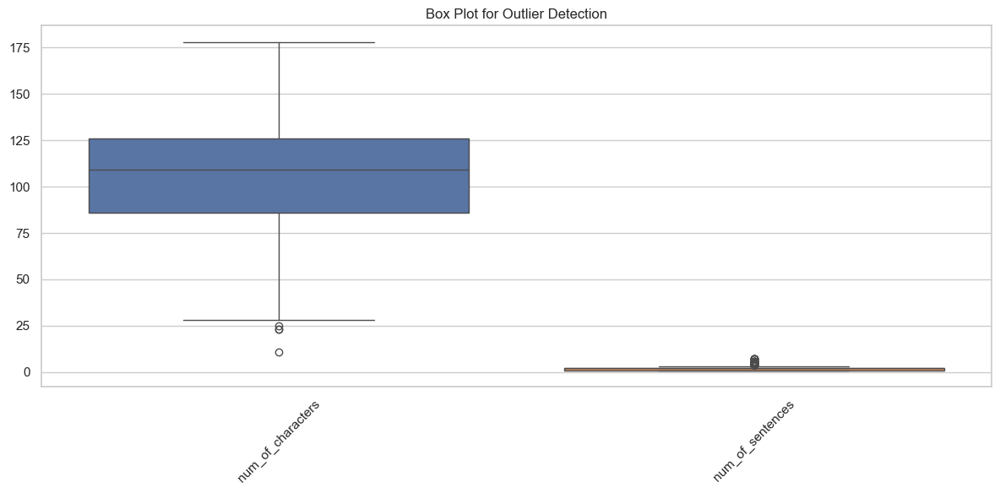

From the box plot above on the number of characters, majority of the the tweets range from slightly above 25 characters to slightly above 175 characters with majority of the data clustered from slightly above 125 characters and between 75 and 100 characters. The box plot on the number of sentences, the number of sentences in the tweets are clustered between 1 and 5 with the marojity of the number of sentences being 2 sentences. 

### 2.2 Univariate Analysis

Comparing each variable at a time.

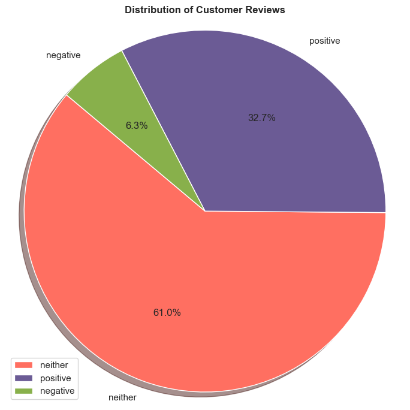

### Key Insights

* Most customers gave **neutral reviews** (61%), indicating that many reviews are neither strongly positive nor negative.
* **Positive reviews** make up nearly one-third of the total, suggesting a generally favorable customer sentiment among those expressing an opinion.
* **Negative reviews** are relatively rare (6.3%), indicating low levels of dissatisfaction.

### Overall Interpretation

The review distribution suggests that customer sentiment is largely **neutral**, with **positive feedback significantly outweighing negative feedback**. This could indicate that while many customers have moderate or mixed experiences, the overall perception is more favorable than unfavorable.

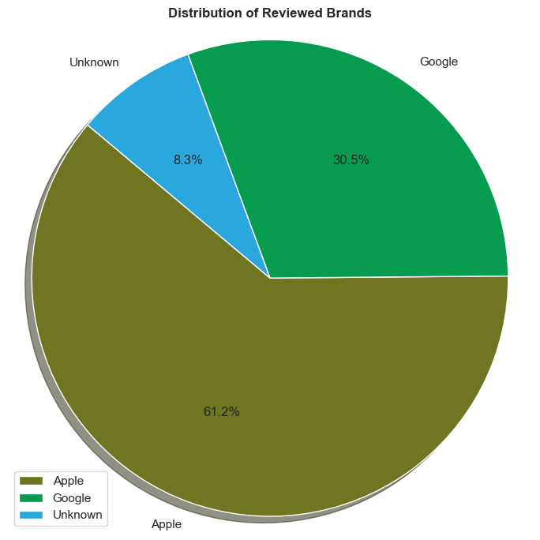

### Key observations

* Apple accounts for **more than three-fifths** of the total reviews.
* Apple and Google together make up **91.7%** of all reviewed brands, indicating that the dataset is heavily concentrated on these two brands.
* The **Unknown** category represents a relatively small portion of the reviews.

### Overall interpretation

The reviewed brands are strongly skewed toward Apple, with Google being the second most frequently reviewed brand. Very few reviews could not be associated with a known brand. This suggests that the dataset is primarily focused on Apple and Google products or services.

### 2.3 Bivariate Analysis

In this part we evaluate relationship between the feature columns and the target column (review)

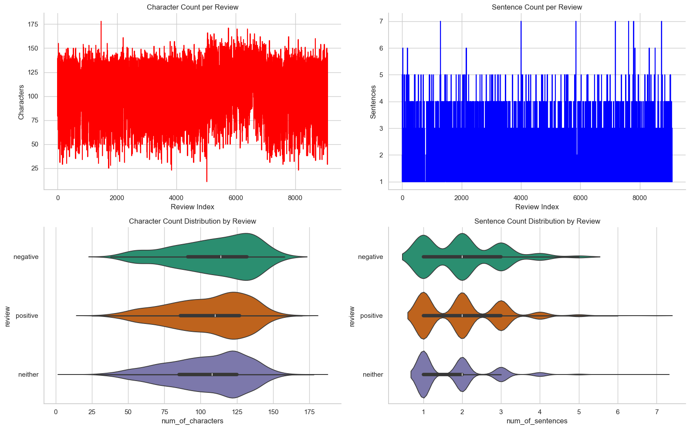

The figure presents a **multivariate exploratory analysis of text-length characteristics** across three sentiment classes (**positive, negative, and neither**). It consists of two line plots and two violin plots.

### In summary:

* From the top left plot, the dataset contains moderately sized texts with no extreme variation, which is beneficial for NLP modeling since document lengths are fairly uniform. 
* From the top right plot, the corpus is dominated by short reviews, which is typical for social media posts, comments, or brief product reviews. 
* From the bottom left plot, the violin plots compare character count distributions across sentiment categories. The three sentiment classes exhibit very similar character-count distributions, this suggests that review length alone may not be a strong predictor of sentiment. 
* From the bottom right plot, the violin plots illustrate the number of sentences across sentiment categories. Sentence count distributions overlap substantially across all sentiment categories. Therefore, sentence count is unlikely to be a highly discriminative feature for sentiment classification.

# 3. Data Preprocessing

This stage involved:
1. removing punctuations, numbers, and other symbols in the tweet_text using the function re()
2. lowering the case of the tweet_text using the function lower()
3. converting the tweet_text into tokens using wordtokenize
4. removing stopwords
5. lemmatizing the text
6. stemming the text

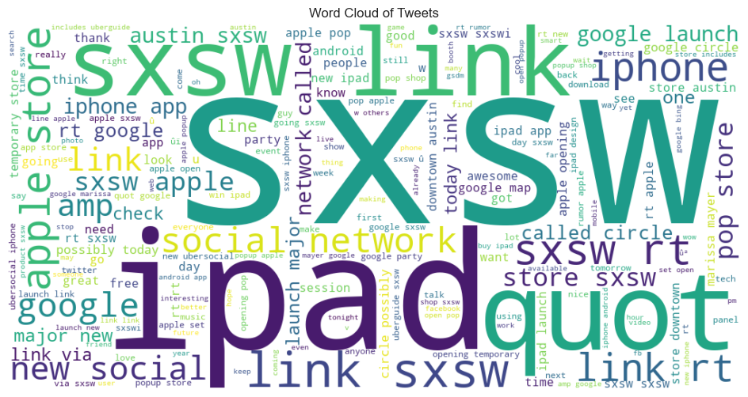

This combines **all tweets**, regardless of sentiment.

### Key observations:

* The most frequent terms overall are: **sxsw**, **ipad**, **link**, **apple**, **store**, **iphone**, **google**, **social**, **network** and **launch**.

* The cloud reflects the main themes of the conversation:
  * Mobile devices (iPad, iPhone, Android)
  * Technology companies (Apple, Google)
  * Apps and app stores
  * Social networking
  * Product launches and announcements

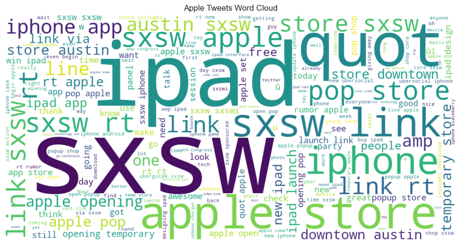

### Key Observations:

* The most dominant words are **ipad**, **sxsw**, **apple**, **store**, **iphone**, **app**, and **link**.
* The prominence of **ipad** and **iphone** indicates that discussions are largely centered on Apple's flagship mobile devices.
* Frequent appearances of **store**, **opening**, **downtown**, and **austin** suggest significant discussion around Apple Store-related events.
* The term **sxsw** (South by Southwest) is highly dominant, indicating that many tweets were generated during or about the SXSW technology event.
* Words such as **launch**, **party**, **free**, and **pop** imply conversations related to product launches, promotions, and event activities.

### In Summary:

The Apple tweets focus heavily on Apple products, especially the iPad and iPhone, with much of the conversation linked to promotional activities and events occurring during SXSW. The overall vocabulary reflects customer engagement with product showcases, store openings, and app-related discussions.

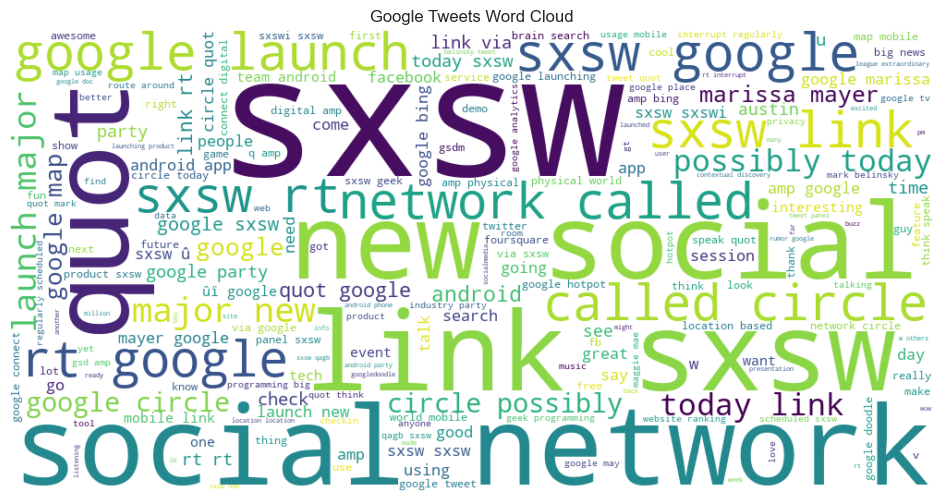

### Key Observations

* The most prominent words are **"social"**, **"network"**, **"new"**, **"called"**, **"circle"**, **"google"**, **"launch"**, and **"sxsw"**.
* The phrase components **"social network called circle"** dominate the cloud, indicating extensive discussion about Google's social networking initiative, Google+ (originally rumored as Google Circle).
* Words such as **"launch"**, **"today"**, **"possibly"**, and **"called"** suggest speculation and anticipation surrounding a product announcement.
* Terms including **"android"**, **"search"**, and **"google"** indicate continued discussion of Google's core products and services.
* Similar to the Apple cloud, **"sxsw"** is highly frequent, confirming that many tweets were associated with the SXSW event.

### Interpretation

Google-related tweets are primarily focused on discussions of a new social networking platform and product launches. The conversation appears more centered on emerging services and industry announcements than on hardware products.

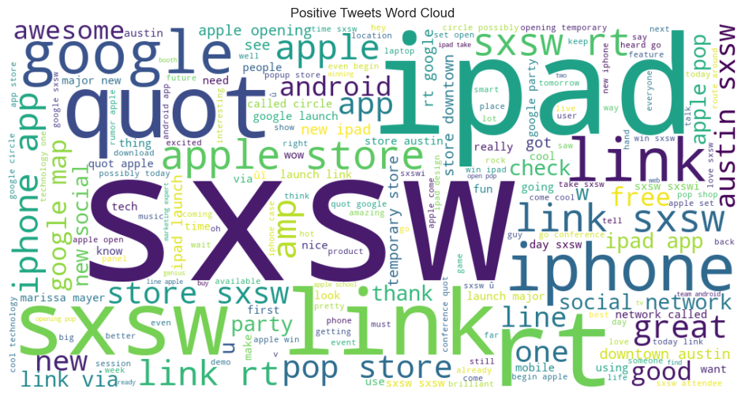

This cloud shows the most common words in **positive** tweets.

### Key observations:

* Again, **sxsw** is the largest word.
* Strongly represented terms include; **google**, **quot** (likely an artifact from tweet text processing),  **link**, **ipad**,  **iphone**, **apple**, **store**, **great**, **awesome**, **free** and **good**.
* Positive tweets contain more explicitly favorable words such as: **awesome**, **great**, **good** and **nice**.

### Interpretation:
Positive discussions revolve around technology launches, apps, Apple and Google products, conference activities, and excitement around SXSW-related announcements.

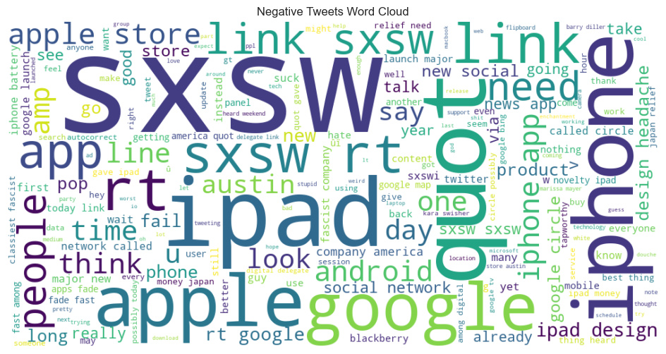

This cloud highlights the most frequent words in tweets classified as **negative**.

### Key observations:

* **sxsw** is the dominant term, indicating the event is the main discussion topic.
* Other prominent words include; **ipad**, **apple**, **google**, **link**, **android**, **store**, **iphone**, **need** and **app**.
* Negative tweets appear to focus on:
  * Technical issues ("link", "app", "store")
  * Product discussions ("ipad", "iphone", "android")
  * Frustrations or unmet expectations ("need", "fail", "problem"-related terms appearing in smaller sizes)

### Interpretation:
Negative sentiment seems tied more to user experiences with apps, devices, links, or conference-related technology rather than strong criticism of a particular company.

# 4. Modeling

## 4.1. Baseline Model: Random Forest Model

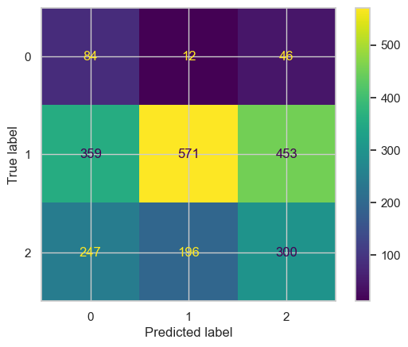

The model had an accuracy of 42% (0.4210758377425044). Performing poorly showing that it predicts correctly 42% of the time. 

The values are:
* True 0: 84 / 12 / 46
* True 1: 359 / 571 / 453
* True 2: 247 / 196 / 300

Class 1 dominates the dataset by far (it has the most total samples), and while 571 of those are correctly predicted (the bright yellow cell), a large number leak into both class 0 (359) and class 2 (453). Class 0 has only 142 total samples and is correctly identified just 84 times, with notable confusion toward class 2. Class 2 (743 samples) is correctly classified only 300 times, with substantial spillover into both other classes (247 to class 0, 196 to class 1). Overall, the model shows weak separability, especially heavy bleed from class 1 into the other two classes.

### 4.1.2. Model 2: Optimized Random Forest Model

The tuned model performs better than the untuned model with an accuracy of 65% (0.6547619047619048). Showing it can predict correctly 65% of the time.

The values are:
* True 0: 54 / 57 / 31
* True 1: 75 / 1012 / 296
* True 2: 23 / 301 / 419

This matrix shows a much sharper diagonal for class 1, jumping from 571 to 1012 correct predictions, with confusion into class 0 nearly eliminated (359 → 75). Class 2's correct predictions also improved (300 → 419), and its confusion with class 0 dropped sharply (247 → 23), though confusion with class 1 remains similar (196 → 301). However, class 0 performance got worse: correct predictions dropped from 84 to 54, with more of its samples now misclassified as class 1 (12 → 57) while misclassification as class 2 stayed similar (46 → 31).

## 4.2. Model 3: Linear Support Vector Machine(SVM) Model

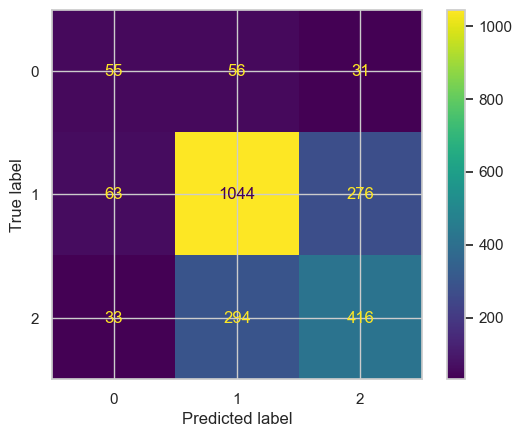

The model has an accuracy of 67% (0.667989417989418). Showing it can predict correctly 67% of the time on unseen data.

The values are:

* True 0: 55 / 56 / 31
* True 1: 63 / 1044 / 276
* True 2: 33 / 294 / 416

This matrix looks very similar in pattern to the previous "opt" model: class 1 (the majority class) is predicted correctly the vast majority of the time (1044/1383), with a notable chunk of class 1 samples misclassified as class 2 (276). Class 0 remains the weakest, with only 55 of 142 correctly identified and roughly equal confusion with classes 1 and 2 (56 and 31). Class 2 is correctly classified 416/743 times, with substantial confusion toward class 1 (294).

### 4.2.2. Model 4: Tuned Support Vector Machine(SVM) Model

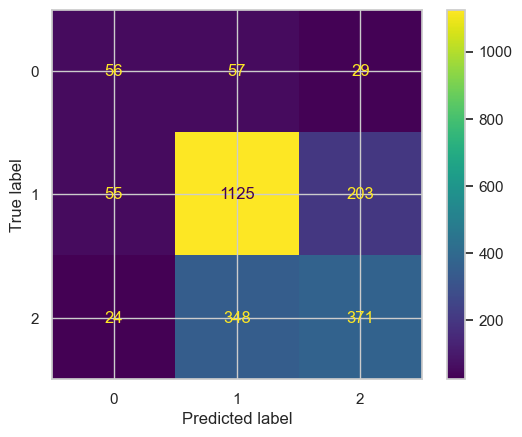

The model has an accuracy of 68% (0.6843033509700176). Showing it can predict correctly 68% of the time on unseen data.

The values are:

* True 0: 56 / 57 / 29
* True 1: 55 / 1125 / 203
* True 2: 24 / 348 / 371

The overall pattern is similar, but tuning shifted performance slightly: class 1's correct predictions increased from 1044 to 1125, and its confusion with class 2 dropped (276 → 203). However, class 2's own accuracy fell (416 → 371), with more of its samples now being misclassified as class 1 (294 → 348). Class 0 stayed essentially unchanged (55 → 56 correct).

## 4.3. Model 4: MultinomialNB Model

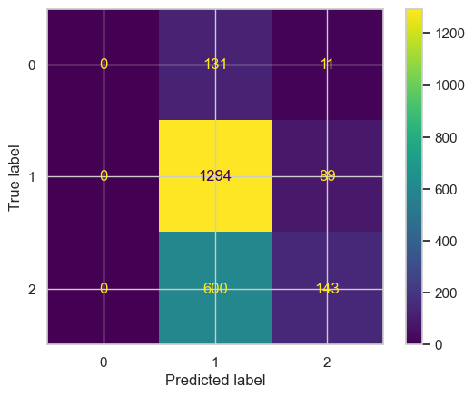

The model has an accuracy of 63% (0.6335978835978836). Showing it can predict correctly 63% of the time on unseen data.

The values are:

* True 0: 0 / 131 / 11
* True 1: 0 / 1294 / 89
* True 2: 0 / 600 / 143

As noted previously, the first column is entirely zero — this model never predicts class 0 at all, so every true class-0 sample is misclassified (mostly into class 1). Class 1 has very high recall (1294/1383), while class 2 is mostly absorbed into class 1 (600 of 743).

### 4.3.2. Model 5: Tuned MultiNomialNB Model

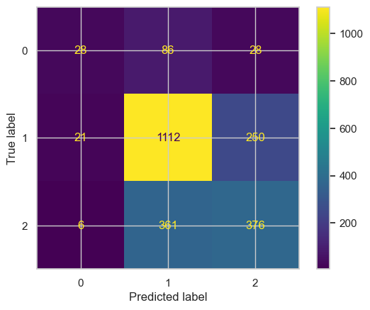

The model has an accuracy of 67% (0.6684303350970018). Showing it can predict correctly 67% of the time on unseen data.

The values are:

* True 0: 28 / 86 / 28
* True 1: 21 / 1112 / 250
* True 2: 6 / 361 / 376

Tuning has clearly changed the model's behavior: class 0 is now predicted at all (the first column is no longer empty), and 28 of the 142 true class-0 samples are now correctly identified. However, this comes with trade-offs elsewhere: class 1's correct predictions dropped from 1294 to 1112, with more spillover into class 2 (89 -> 250). Class 2's correct predictions increased from 143 to 376, with reduced (but still substantial) confusion toward class 1 (600 -> 361).

## 4.4. Model 6: KNearestNeighbours Model

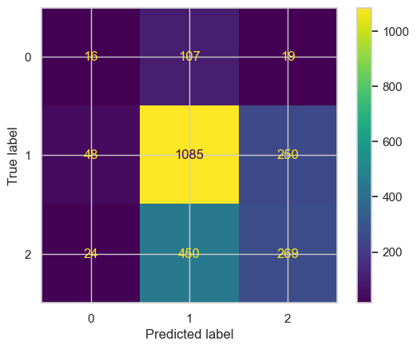

The model has an accuracy of 60% (0.6040564373897708). Showing it can predict correctly 60% of the time on unseen data.

The values are:
* True 0: 16 / 107 / 19
* True 1: 48 / 1085 / 250
* True 2: 24 / 450 / 269

Class 0 performs poorly here, with only 16 of 142 samples correctly classified, while a large majority (107) are misclassified as class 1. Class 1 again shows strong recall, with 1085 of 1383 correctly classified, and the remaining samples split between class 0 (48) and class 2 (250). Class 2 is correctly classified 269 of 743 times, but a substantial portion (450) is misclassified as class 1, with a smaller amount (24) going to class 0.

## 4.5. Model 7: Keras Sequential Model

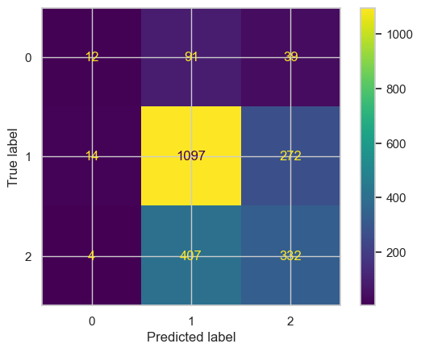

The model has an accuracy of 64% (0.6353615520282186). Showing it can predict correctly 64% of the time on unseen data.

The values are:
* True 0: 12 / 91 / 39
* True 1: 14 / 1097 / 272
* True 2: 4 / 407 / 332

Class 0 performs weakly, with only 12 of 142 samples correctly classified (≈8%), and the majority (91) misclassified as class 1, with another 39 going to class 2. Class 1 again shows very strong recall, with 1097 of 1383 correctly classified (≈79%), and a near-negligible number (14) misclassified as class 0, with 272 going to class 2. Class 2 is correctly classified 332 of 743 times (≈45%), though 407 samples are misclassified as class 1, and only 4 as class 0.

# 5. Model Evaluation

Across the seven models evaluated, accuracy ranged from 42% to 68%, with a clear split between the weak baseline and the rest of the tuned/alternative models.

The baseline Random Forest performed by far the worst, at just 42% accuracy, driven largely by heavy misclassification of class 1 samples into classes 0 and 2. Simply tuning the Random Forest produced the single biggest jump in the whole study, raising accuracy to 65% mainly by sharpening class 1's diagonal (correct predictions roughly doubling from 571 to 1012), though this came at a small cost to class 0 recall.

The Linear SVM picked up from there at 67%, with a pattern very similar to the optimized Random Forest — strong on class 1, weak on class 0 (55/142 correct), moderate on class 2. Tuning the SVM nudged accuracy slightly higher to 68%, the best result of all seven models, by further boosting class 1's correct predictions (1044 → 1125) and reducing its confusion with class 2, though this traded off some class 2 accuracy (416 → 371) and left class 0 essentially unchanged.

The MultinomialNB models told a different story. The untuned version reached 63% accuracy but achieved this by completely ignoring class 0 — it never predicted that class at all, meaning every true class-0 sample (142 of them) was misclassified. After tuning, accuracy rose to 67% and, more importantly, the model became meaningfully more balanced: it correctly identified 28 of the 142 class-0 samples for the first time, and class 2 recall jumped substantially (143 → 376), at the cost of some class 1 accuracy.

KNN and the Keras neural network landed in the middle of the pack at 60% and 64% respectively. Both showed the now-familiar pattern of class 1 dominating predictions, with class 0 performing especially poorly — KNN correctly identified only 16/142 class-0 samples, and the neural network did even worse at just 12/142 (≈8%), the weakest class-0 result of any model tested.

**Overall pattern:** Every model struggled with class 0, which is the smallest class (142 samples) and consistently gets absorbed into class 1's predictions. Class 1, with by far the largest sample count, dominates every model's predictions and recall, while class 2 sits in between, with varying degrees of confusion with class 1.

**Best model:** The Tuned SVM is the strongest overall performer, achieving the highest accuracy (68%) while also maintaining the best class 0 recall among the higher-accuracy models (56/142 ≈ 39%, compared to the tuned NB's 28/142 ≈ 20%). It offers the best balance of overall accuracy and per-class performance.

# 6. Conclusion

The objective of this project was to develop a Natural Language Processing (NLP) model capable of classifying the sentiment of tweets related to Apple and Google products into positive, negative, or neutral categories. Through data preprocessing, exploratory data analysis, feature extraction using TF-IDF, and machine learning model development, meaningful insights were obtained from the Twitter dataset.

The exploratory analysis revealed that discussions around Apple were primarily focused on products such as the iPad and iPhone, while Google-related discussions centered on social networking services, Android, and product launches. Word cloud analysis further highlighted the influence of the SXSW event on conversations surrounding both companies.

The developed sentiment classification model demonstrated the ability to automatically identify customer opinions expressed in tweets, providing a scalable alternative to manual sentiment assessment. The findings indicate that social media data can serve as a valuable source of information for understanding customer perceptions, monitoring brand reputation, and identifying emerging trends and concerns.

Overall, the project successfully demonstrated the effectiveness of NLP and machine learning techniques in extracting actionable insights from unstructured social media text data.

# 7. Recommendations

1. Companies should continuously monitor social media platforms to understand customer opinions and identify issues affecting customer satisfaction in real time.

2. Future work should explore advanced NLP techniques such as Word2Vec, GloVe, BERT, and transformer-based models, which may provide higher classification accuracy by capturing contextual meaning.

3. Additional data from multiple social media platforms such as Facebook, Reddit, and Instagram could be incorporated to provide a more comprehensive view of customer sentiment.

4. Regular model retraining should be implemented to account for evolving language patterns, slang, abbreviations, and emerging product trends on social media.

5. Aspect-based sentiment analysis could be performed to identify sentiments toward specific product features such as battery life, user interface, performance, pricing, and customer support.

6. Businesses should integrate sentiment analysis dashboards into their decision-making processes to support marketing strategies, product improvements, and customer engagement initiatives.

7. Future studies should investigate the impact of major events, product launches, and promotional campaigns on customer sentiment and brand perception over time.

8. Techniques for handling class imbalance and improving minority-class prediction should be explored to further enhance model robustness and generalization performance.